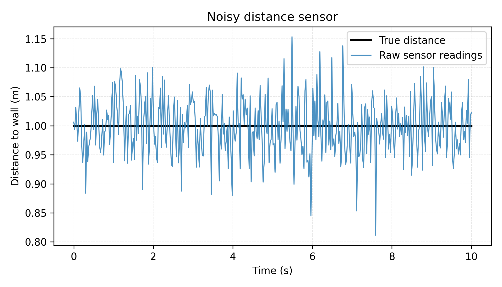
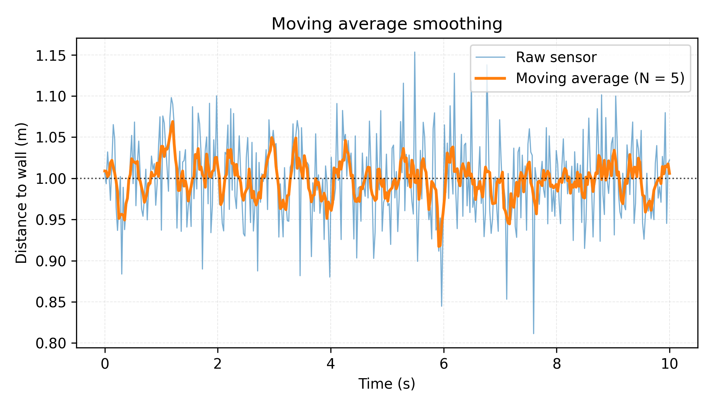
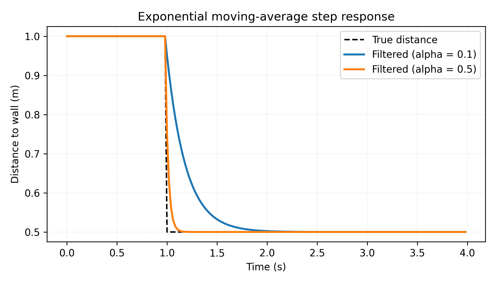
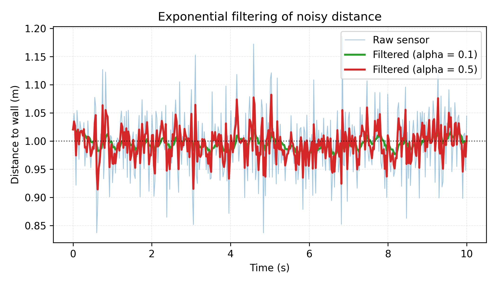
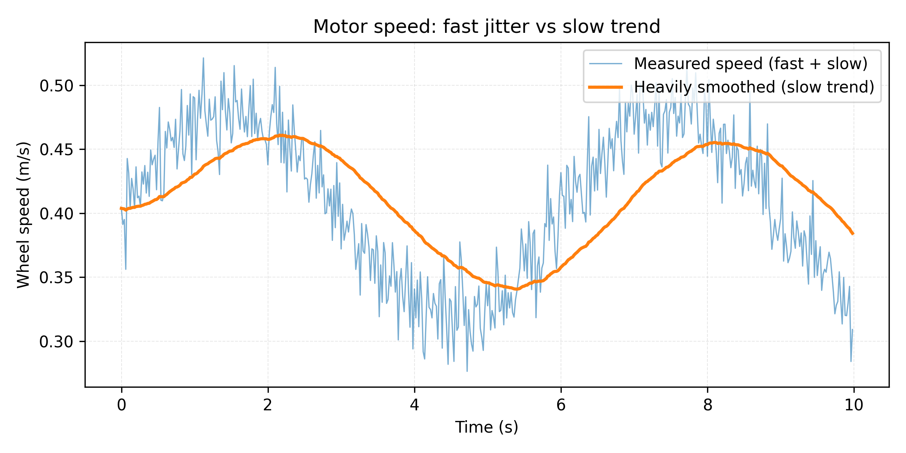
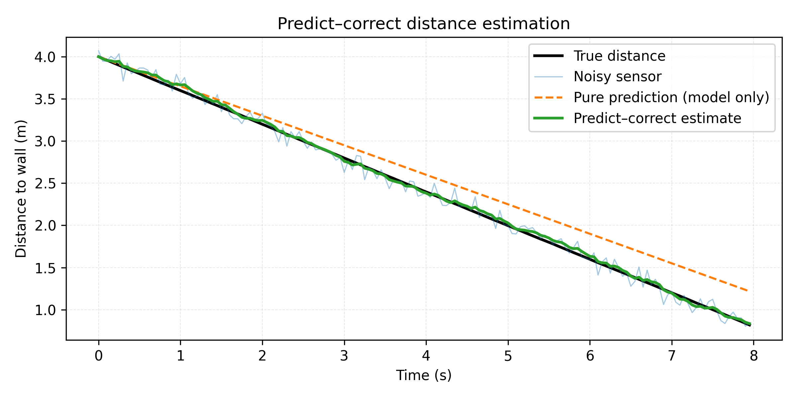
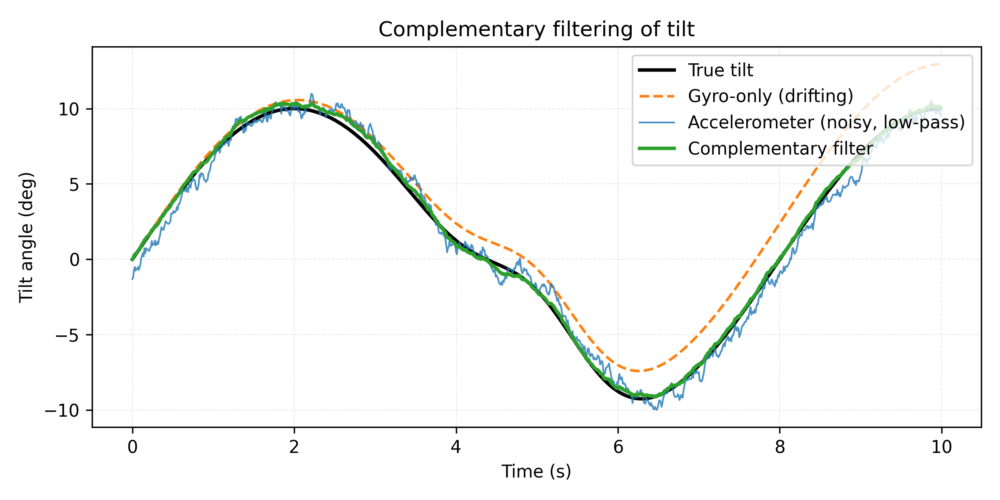

Filters and Noisy Sensors
=========================

## 1. Why do we even need filters?

When you write your first robot program, it is tempting to think like this:

- You read a sensor once.
- You get **the** distance, **the** angle, or **the** speed.
- You use that number to decide what to do.

Reality is much less kind.

Sensors lie all the time – not in a dramatic way, but in a small, jittery, annoying way.
If we take every single reading literally, the robot ends up twitchy, overreacting to every tiny blip.

In this chapter, we will talk about **filters**: small pieces of code that take a messy sequence of sensor readings and turn them into **smooth, believable numbers** you can actually control with.

We will keep the examples very simple, and we will not assume you have read any other chapters.
We will mainly return to three easy-to-visualize scenarios:

1. A robot with a **noisy distance sensor** pointing at a wall.
2. A motor with an **encoder** whose speed measurement jumps around a bit.
3. A simple robot with **line sensors** trying to follow a (black) line on the (white) floor.


### Example: a shaky distance sensor

Imagine a small robot sitting still, facing a wall.
It has a distance sensor on the front that tells you “how many centimeters to the wall”.
In the real world, if the robot is not moving, the true distance is constant – for example, exactly 1.0 m.

But when you log the sensor readings over time, you might see something like:

- 0.94, 1.02, 1.10, 0.98, 1.01, 0.93, 1.06, 0.99, …

Nothing dramatic is happening in the world – the robot is not moving and the wall is not moving – but the readings jump around by a few centimeters because of noise, reflections, small changes in lighting, etc.

If, each control loop, you directly use the **latest** reading to decide what to do (“If distance < 0.95, back up!”), the robot might nervously twitch in and out of backing-up mode, even though nothing meaningful changed.

#### Suggested figure



*Graph: Time on the x-axis, distance on the y-axis. Show the true distance as a flat horizontal line at 1.0 m, and the raw sensor readings as noisy points or a jagged line around it.*

### Example: noisy motor speed from an encoder

Now imagine you have a wheel with an encoder.
You send a fixed power command to the motor (for example, 0.4 on a scale from -1 to 1), and you expect the wheel speed to settle somewhere.
You then compute speed every 20 ms from the encoder ticks.

If you plot the computed speed, you might see:

- Sometimes 0.35 m/s, sometimes 0.39, sometimes 0.32, sometimes 0.37…

Again, the real physical speed is almost constant, but your estimated speed jumps around because of quantization (integer tick counts), friction changes, and small timing variations.
If you feed this noisy speed straight into a controller (for example, one that tries to keep speed close to a goal), the controller will “see” imaginary changes and keep overreacting.

### Filters: smoothing and “controlled forgetfulness”

The core idea in this chapter:

- **Do not trust a single reading.**
- Instead, **combine many readings over time** into a smoother, more believable value.

We will:

- Start with **simple averages** over time.
- Move to **leaky memory** (exponential moving averages).
- Then think in terms of **time-scales** (what changes fast vs slow).
- Then combine **prediction** (what we expect) with **correction** (what sensors say).
- Finally, show how to **combine different sensors** using a simple “complementary filter”.

Throughout, we will focus on intuition and graphs, not formal control theory.

---

## 2. Simple averaging over time

The simplest way to make a noisy number calmer is to **average** the last few readings.
Instead of using just the latest measurement, we keep a short memory of the recent past and take the average.

This already gives us a very useful filter.

### 2.1 Moving average (box filter)

Suppose our distance sensor gives readings

- $d_1, d_2, d_3, \dots$

At time step $k$, instead of using just $d_k$, we use the average of the **last $N$** readings:

$
  \bar{d}_k = \frac{d_k + d_{k-1} + \dots + d_{k-N+1}}{N}.
$

This is called a **moving average** (or a box filter).

- If $N = 1$, we are not filtering at all – we just use the latest reading.
- If $N$ is bigger, we smooth more aggressively.

#### Example with the distance sensor

Imagine we take a moving average with $N = 5$.
Every control cycle, we:

1. Read the latest sensor value.
2. Put it into a small buffer of the last 5 readings.
3. Compute the average of those 5 numbers.
4. Use this average for our decisions instead of the raw reading.

Now, a single “bad” reading (for example, 0.90 instead of 1.0) does not instantly make your robot panic and back away.
It only pulls the average slightly down.

#### Suggested figure



*Graph: Plot the same noisy distance readings as before (jagged), and also plot the 5-sample moving average as a smoother line that lags slightly behind but stays close to the true distance.*

### 2.2 What do we gain and what do we lose?

The moving average gives us two main effects:

- **Less noise**: random spikes get averaged out.
- **More lag**: the filtered value reacts more slowly to real changes.

This tradeoff shows up everywhere in filtering:

- Large $N$: very smooth, but slow to react.
- Small $N$: less smooth, but reacts quickly.

You can think of it as:

- With large $N$, the filter is “stubborn”. It remembers a lot of the past and does not change its mind easily.
- With small $N$, the filter is “forgetful”. It changes quickly but is more easily fooled by noise.

### 2.3 Implementation sketch

Here is a simple way to implement a moving average over the last $N$ readings for any 1D sensor:

```python
N = 5
buffer = [0.0] * N
index = 0
count = 0       # how many valid entries we have so far

def update_filter(new_value):
    global index, count
    buffer[index] = new_value
    index = (index + 1) % N
    count = min(count + 1, N)
    
    # compute average of valid entries
    total = 0.0
    for i in range(count):
        total += buffer[i]
    return total / count
```

This is not the most efficient possible implementation, but it is very clear and easy to adapt.

**Takeaway:** The moving average is the simplest filter: it looks at a fixed-sized window in time, smooths out noise, and introduces some lag.

---

## 3. Exponential moving average: “leaky memory”

The moving average uses a **hard window**: last $N$ readings all count equally; anything older is forgotten completely.

There is another very common and often more convenient filter:

$
  x_{\text{filtered}} \leftarrow (1 - \alpha)\,x_{\text{filtered}} + \alpha\,x_{\text{new}}.
$

This is called an **exponential moving average** or a **first-order low-pass filter**.
We will think of it as **leaky memory**:

- We keep a memory of the past value.
- Every time we get a new reading, we move our memory a little bit towards the new value.

### 3.1 The update rule

Assume we maintain a variable `filtered` that stores our current best guess.
Each time a new measurement `m` arrives, we do:

```python
alpha = 0.2   # between 0 and 1

filtered = (1.0 - alpha) * filtered + alpha * m
```

You can also write it as:

```python
filtered += alpha * (m - filtered)
```

which reads: “take a step of size `alpha` towards the new measurement”.

### 3.2 Interpreting alpha

The parameter $\alpha$ controls how quickly the filter reacts:

- If $\alpha$ is **small** (for example, 0.05):
  - The filter changes **slowly**.
  - It has **long memory** → very smooth but more lag.
- If $\alpha$ is **large** (for example, 0.5):
  - The filter changes **quickly**.
  - It has **short memory** → less smooth but less lag.

You can think of `filtered` as a heavy object on a table, and `m` as a hand that nudges it toward a new position every time step.
$\alpha$ is how hard you push: the harder you push, the faster it moves.

### 3.3 Step response: reacting to real changes

To understand lag, imagine the true distance suddenly changes:

- At time 0, the wall suddenly moves closer, and the true distance jumps from 1.0 m to 0.5 m.

Assume for the moment that our sensor is perfect (no noise) and instantly reports the new value 0.5 m.
Even then, the filtered value won’t jump immediately; it will approach 0.5 gradually.

#### Suggested figure



*Graph: Show the true distance as a piecewise-constant signal (1.0 then 0.5). Plot filtered outputs for $\alpha = 0.1$ (slow response) and $\alpha = 0.5$ (fast response). The curves should be smooth exponentials approaching 0.5 with different speeds.*

This shows clearly:

- **Smaller $\alpha$** means slower adaptation to real changes.
- **Larger $\alpha$** means faster adaptation, but later we will see that it also lets more noise through.

### 3.4 Noisy constant signal: reacting to noise

Now go back to the original situation where the true distance is constant at 1.0 m, but the readings bounce around.

If we apply the exponential moving average to the noisy readings:

- For small $\alpha$, the filtered line is very smooth and stays near 1.0, ignoring most random jumps.
- For large $\alpha$, the filtered line still follows the noise somewhat, but less than the raw signal.

#### Suggested figure



*Graph: Plot raw noisy distance, plus two filtered curves ($\alpha = 0.1$ and $\alpha = 0.5$). Show that $\alpha = 0.1$ is smoother but slower, $\alpha = 0.5$ reacts faster but is noisier.*

### 3.5 Comparison with moving average

Both the moving average and the exponential filter:

- Reduce noise.
- Introduce lag.

Some practical differences:

- Moving average:
  - Needs to store the last $N$ samples.
  - All samples inside the window have equal weight.
  - Samples older than the window are completely forgotten.
- Exponential filter:
  - Needs to store only one number (`filtered`).
  - Recent samples have higher weight; older samples gradually fade.
  - There is no sharp cutoff; memory fades smoothly.

For many robotics applications, the exponential filter is a very convenient default: it is easy to implement, uses little memory, and lets you easily tune how quickly the filter “believes” new readings.

**Takeaway:** Exponential filters are like a memory that slowly forgets the past. The parameter $\alpha$ is how quickly it forgets.

---

## 4. Thinking in time-scales

So far, we have mostly thought, “we want less noise”, and we used filters to make graphs look smoother.
There is another way to think about filters that is very useful in robotics:

> **What time-scales do we care about?**

In other words:

- What changes **fast** that we want to ignore?
- What changes **slowly** that we want to keep?

### 4.1 Motor speed: fast wiggles vs slow changes

Return to the motor speed example.
You send a fixed power command and measure speed with an encoder every 20 ms.

If you zoom into the data, you might see:

- Very fast wiggles every 20–40 ms, due to individual encoder ticks.
+- Much slower changes over hundreds of milliseconds or seconds, due to friction changes, battery voltage, or you commanding a new target speed.

If your control loop runs at 50 Hz (every 20 ms), you might ask:

- Do I really care about tiny changes that happen within one or two time steps?
- Or am I mostly interested in “the average speed over a few tenths of a second”?

If you decide that **only slower changes matter**, then it is natural to deliberately remove fast wiggles with a filter.

#### Suggested figure



*Graph: Show the raw estimated motor speed with small high-frequency jitter overlaid on a slow drift. Also plot a heavily smoothed version that captures only the slow drift. Mark the “fast” and “slow” components visually.*

### 4.2 Distance sensor: robot approaching a wall

Consider the distance robot again, but now it is **driving towards the wall** at a slow, steady speed.

The true distance vs. time is a smooth, gently decreasing curve.
On top of that, the raw sensor gives noisy, jittery samples.

If you choose $\alpha$ so that the filter reacts on roughly the same time-scale as “how quickly we approach the wall”, then:

- The filtered distance is smooth enough to ignore random noise.
- But it still tracks the actual closing distance reasonably quickly.

If you choose $\alpha$ too small (filter too slow):

- The filter might report “still far away” even when you are already very close, because it is still stuck remembering the past.

If you choose $\alpha$ too large (filter too fast):

- You get almost no benefit; the filtered output still jumps almost as much as the raw data.

The right choice depends on:

- How fast the real world is changing.
- How quickly your control loop reacts to changes.

### 4.3 Filters as time-scale selectors

One useful mental model:

- A filter is a **time-scale selector**.
- It passes through changes that are slower than its “reaction time”.
- It suppresses changes that are faster than its “reaction time”.

In practice, when you choose $\alpha$ or $N$, you are answering:

> “How many control-loop steps should it take for my estimate to respond to a real change?”

**Takeaway:** Instead of thinking “I just want less noise”, think “I want to ignore changes faster than X, and still see changes slower than X”. Then pick filter parameters that roughly match that time-scale.

---

## 5. Predict and correct: filtering as “best guess of hidden state”

So far, our filters have only used **current measurements** and **past filtered values**.
We have not used any knowledge of how the robot is *supposed* to move.

But in many robotics problems, we know something about how the world behaves:

- If a robot moves with constant speed $v$, its position changes by $v \Delta t$ every time step.
- If we are facing a wall and we know our forward speed, we can predict how the distance should shrink.

We can use this to build a slightly smarter filter:

1. **Predict** what we expect the state to be, based on the previous state and our motion.
2. **Correct** that prediction using a (noisy) measurement.

This is still a filter, but now it also uses a simple model of the world.

### 5.1 1D example: tracking distance to a wall

Consider again the robot driving straight toward a wall.
We want to estimate the distance $d$ over time.

We have:

- Control input: forward speed command $v_{\text{cmd}}$.
- Unknown true state: actual distance to the wall $d$.
- Noisy measurements: sensor readings $z$ (distance sensor).

We will keep a variable `d_est` – our **estimated distance**.

Every control loop (every $\Delta t$ seconds) we do:

1. **Predict** how distance changes due to motion.
2. **Correct** that prediction based on the noisy sensor.

### 5.2 Predict step

If the robot is moving roughly straight towards the wall at speed $v$, distance should shrink by $v \Delta t$ each step.
So we can predict:

```python
d_est = d_est - v * dt
```

This uses our model: “distance decreases at rate $v$”.

Of course, this prediction is not perfect:

- Maybe the floor is slippery and the wheel slips.
- Maybe the robot slightly slows down going up a ramp.

But it still gives us a reasonable guess of what *should* happen if everything is ideal.

### 5.3 Correct step: blending with measurement

Next, we read the noisy distance measurement `z` from the sensor.

We could directly replace `d_est` with `z`, but then we would throw away our prediction.
Instead, we combine them:

```python
beta = 0.2   # how much we trust the sensor vs our prediction

innovation = z - d_est         # how wrong our prediction was
d_est = d_est + beta * innovation
```

Again, this is just an exponential filter, but now applied to the **prediction error**.
We are saying:

- If the sensor reading mostly agrees with our prediction, we change `d_est` only a little.
- If the sensor reading strongly disagrees, we move `d_est` more toward the sensor.

### 5.4 Putting it together

Every loop:

```python
# 1. Predict
d_est = d_est - v * dt

# 2. Measure
z = read_distance_sensor()

# 3. Correct
beta = 0.2
d_est = d_est + beta * (z - d_est)
```

This is a tiny “predict–correct” filter.

### 5.5 Why bother predicting?

At first glance, this might feel like extra work.
Why not just filter the sensor directly with an exponential average?

The advantage of prediction shows up when:

- Sensors are temporarily unavailable (for example, the distance sensor gets saturated at very close range).
- Sensors are extremely noisy in some situations.
- You have a decent idea of how the state should evolve (for example, wheel encoders are reliable in the short term).

When the sensor is missing or very noisy, prediction alone can carry the estimate for a short time.
When the sensor is available, we gently pull the estimate back toward reality.

#### Suggested figure



*Graph: Show true distance (smooth curve), noisy sensor readings (dots), pure prediction from motion model (curve that drifts away gradually), and the combined predict–correct estimate (curve that stays close to the truth).*

**Takeaway:** You can think of filtering as “What is my best guess of the hidden state, combining what my model predicts and what my sensors say?”

---

## 6. Combining sensors: the complementary filter

So far, we have mostly talked about a **single** sensor.
In many robots, we measure the same physical quantity in more than one way, using different sensors.

For example, consider estimating the **tilt angle** (pitch or roll) of a robot:

- An **accelerometer** can estimate tilt by measuring gravity, but its reading is very noisy in the short term and sensitive to linear acceleration.
- A **gyroscope** measures angular velocity very well in the short term, but its integration over time drifts slowly (small bias accumulates).

We have:

- Accelerometer: good **long-term** truth, bad short-term noise.
- Gyro: good **short-term** changes, bad long-term drift.

We would like an estimate that is good in both senses.

### 6.1 Intuition: two friends with different strengths

Imagine two friends:

- Friend A (accelerometer) is calm and reliable in the long run, but their instant reactions are a bit jittery.
- Friend B (gyro) reacts quickly and tracks rapid changes well, but gets slowly confused over many seconds.

To get the best overall advice:

- For **slow trends**, you mostly listen to Friend A.
- For **fast changes**, you mostly listen to Friend B.

This is exactly what a **complementary filter** does.

### 6.2 Basic complementary filter for tilt

Let:

- $\theta_{\text{gyro}}$ be the tilt estimate from integrating the gyro.
- $\theta_{\text{accel}}$ be the tilt estimate from the accelerometer.
- $\theta$ be our combined estimate.

A simple complementary filter update is:

1. Integrate the gyro to predict the new angle:

   ```python
   theta = theta + gyro_rate * dt
   ```

2. Correct the slow drift using the accelerometer reading:

   ```python
   k = 0.02   # small correction factor
   theta = (1.0 - k) * theta + k * theta_accel
   ```

This says:

- Most of the time, follow the gyro (fast, responsive).
- Very slowly, nudge the estimate back toward the accelerometer’s long-term truth.

### 6.3 Viewing it as combining filters (explain what high, low-pass filters are)

Another way to see it:

- The gyro-based angle (after integration) is effectively **high-pass filtered**: it captures fast changes well but has low-frequency drift.
- The accelerometer-based angle is effectively **low-pass filtered**: it is noisy instant by instant but has a good low-frequency average.

The complementary filter adds:

- A **high-pass** part from the gyro.
- A **low-pass** part from the accelerometer.

They are “complementary”: one covers what the other is weak at.

#### Suggested figure



*Graph: Plot the true tilt (smooth), gyro-only estimate (tracks fast changes but slowly drifts away), accelerometer-only estimate (noisy but centered), and complementary estimate (smooth and accurate).*

### 6.4 Connections to earlier ideas

Notice how the complementary filter is built from the same ingredients as before:

- It uses **prediction** (integrating the gyro) and **correction** (blending toward accelerometer).
- The correction step is just another exponential filter with a small gain $k$.
- It relies on **time-scales**: we trust different sensors at different time-scales.

The main new idea is: when you have multiple sensors, you can design filters that **intentionally mix their strengths**.

**Takeaway:** Complementary filters are simple, powerful ways to combine a “fast but drifting” sensor with a “slow but stable” one.

---

## 7. Applying filters in simple robotics problems

Let us briefly return to our earlier two examples and see how we might actually use filters in code.

### 7.1 Distance-based stopping

Suppose you want the robot to drive towards a wall and stop smoothly at 0.3 m.

Without filtering:

- You might write `if distance < 0.3: stop`.
- With noisy readings, sometimes you see 0.29 m early and stop too soon, or 0.31 then 0.28 and jitter.

With a simple exponential filter:

1. Maintain `d_filtered` using the exponential rule.
2. Decide based on `d_filtered`:

   ```python
   if d_filtered < 0.3:
       stop()
   ```

Now:

- Random spikes below 0.3 m are less likely to trigger a stop.
- The robot responds to a **trend** (distance really shrinking) rather than a single lucky reading.

Note that you might need to slightly alter (increase) threshold, so that `d_filtered` actually stops at $0.3$.

### 7.2 Motor speed control

Suppose you want to control motor speed using encoder feedback.
You measure speed every control loop and compare it to a desired speed.

If you feed the raw speed into your controller:

- The controller “thinks” speed is bouncing, so it keeps changing the motor command.
- The motor command becomes noisy, which can make the actual speed noisier too.

If you instead filter the measured speed:

```python
speed_measured = compute_speed_from_encoder()
speed_filtered = (1.0 - alpha) * speed_filtered + alpha * speed_measured

error = target_speed - speed_filtered
command = k_p * error   # simple proportional controller, for example
send_to_motor(command)
```

then:

- The controller reacts to **smoothed** speed.
- Small, high-frequency measurement noise does not cause large corrections.

You still have to choose $\alpha$ carefully:

- Too small ($\alpha$ very low): the controller reacts slowly when you actually change the target speed.
- Too large: you get less filtering and more noisy commands.

**Takeaway:** A very common pattern is: filter the **measurement** before giving it to the controller. This usually works better than filtering the **command**.

---

## 8. Practical recipes and common pitfalls

To close the chapter, here are some simple, practical guidelines.

### 8.1 When to use a simple average vs exponential filter

- If you:
  - Are just starting out,
  - Have a signal that you read at a fixed rate,
  - And want something easy to tune,
  
  then start with an **exponential filter**.

- If:
  - You like the idea “keep the last N samples and average them”,
  - And you don’t mind a bit of extra memory,
  
  then a **moving average** is also fine, especially for slower signals like battery voltage or very slow distance changes.

In many robotics systems, exponential filters are preferred because they are:

- Simple (one line of code).
- Memory-light.
- Easy to adjust by changing a single number $\alpha$.

### 8.2 How to pick alpha (or N)

A rough way:

- Decide how quickly you want the filtered value to react to a real step change (for example, “be close to the new value in about 0.5 seconds”).
- Convert that feeling into a proportion of your control-loop rate.

For example:

- If your control loop runs at 50 Hz (every 0.02 s) and you want the filter to react on the order of half a second (about 25 steps), you might start with $\alpha$ around 0.1–0.2.
- Then log data, plot it, and adjust until it “feels right” for your application.

There is a lot of theory about optimal choices, but in practice, a bit of plotting and intuition goes a long way.

### 8.3 Common pitfalls

- **Filter is too slow (too much lag).**
  - Symptom: the robot reacts late to real changes (for example, braking too late because filtered distance says you are still far away).
  - Fix: increase $\alpha$ or decrease $N$ so the filter reacts faster.

- **Filter is too fast (almost no smoothing).**
  - Symptom: filtered signal still looks very noisy; controller output is jittery.
  - Fix: decrease $\alpha$ or increase $N$.

- **Filtering the wrong thing.**
  - Symptom: Robot still behaves jittery or unstable, even though you applied a filter somewhere.
  - Fix: Usually, you want to filter **measurements** (sensor values or estimated states), not the **commands** you send to actuators.

- **Ignoring time-scales.**
  - Symptom: You pick $\alpha$ blindly and later realize that either you are filtering away changes you actually care about, or you are still responding to noise you did not care about.
  - Fix: Think explicitly: “What is the fastest change in this quantity that I care about?” and set the filter to be just a bit faster than that.

### 8.4 Final thoughts

Filters are not magic.
They cannot create information that is not there.
But they are extremely useful at:

- Ignoring small, fast, meaningless fluctuations.
- Producing calm, believable numbers you can use for control.
- Combining knowledge of how the world should move with noisy sensor readings.

As you build more complex robots, you will encounter more advanced filters (like the Kalman filter), but the core ideas remain the same as in this chapter:

- Average over time.
- Decide which time-scales you care about.
- Predict what should happen.
- Correct based on what you actually see.

If you keep these simple pictures in mind – noisy plots, smoothed plots, and step responses – you will already have strong intuition for how filters behave, long before you see any heavy math.


