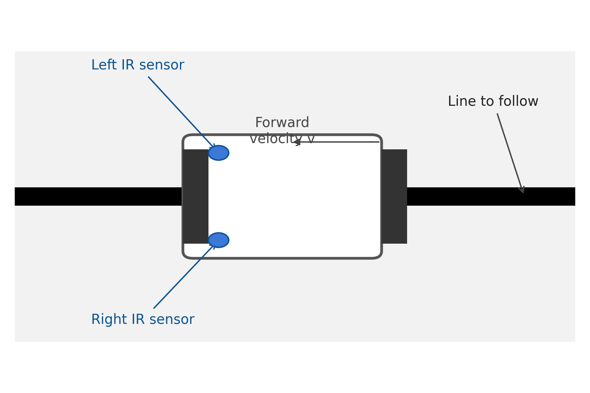
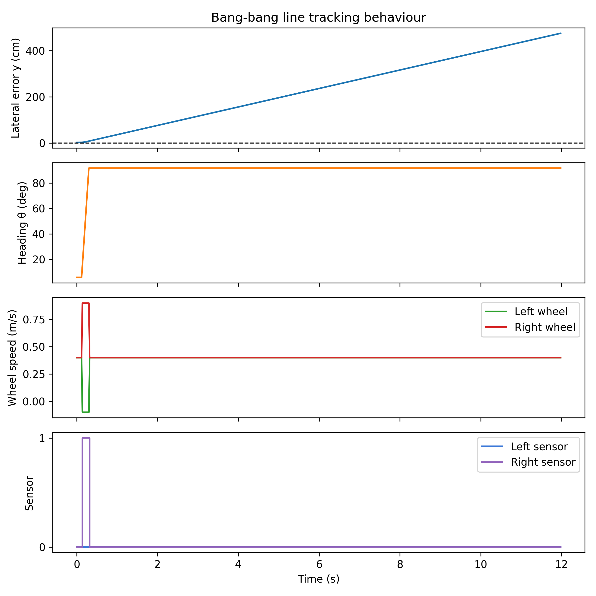
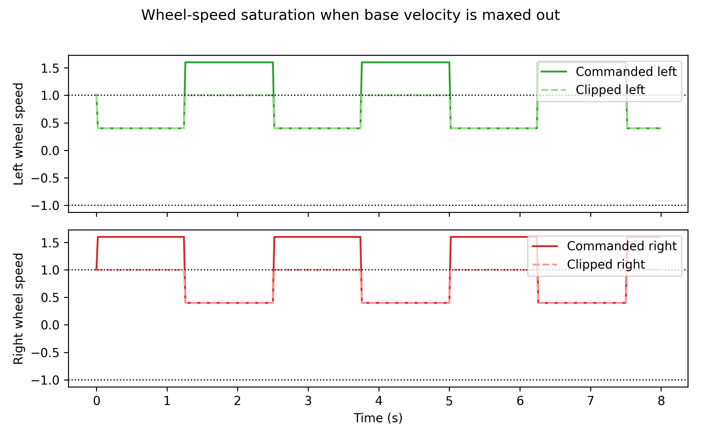
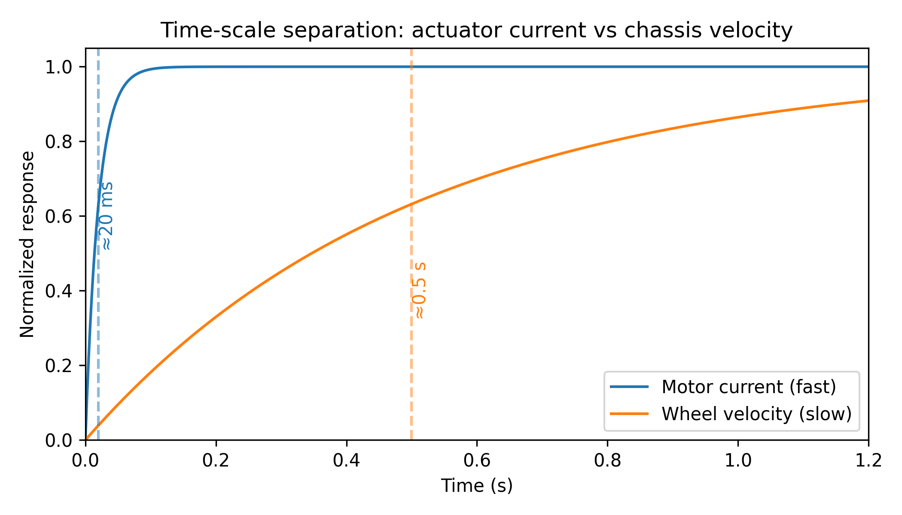
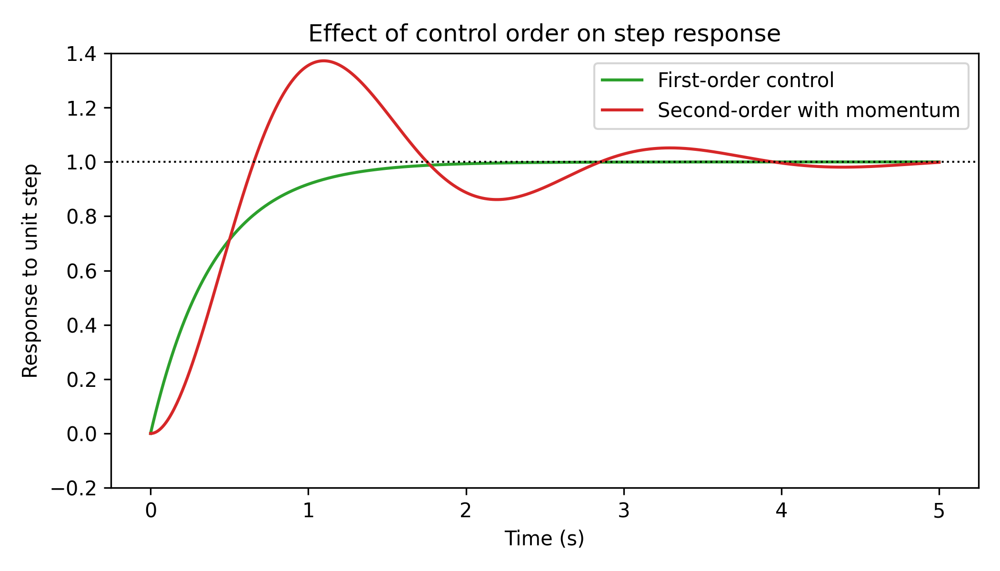

Extra notes:

Independent split


Classification of time-scales and order of control + time-scale separation as an indepdendent split

To setup line follower robot, analyze what are time-scales, roughly, and say which model is most relevant


# Line follower robot:

## Introduction:

Suppose we have a line follower robot. It is supposed to follow a black line on a white floor. The goal is to stay on the line - otherwise the robot gets lost (ofc, refine the setup). ATTACH A GRAPH/IMAGE
It has 2 motors/wheels, 2 sensors, one on each side (close to motor) - and it outputs either 0 (if it doesn't see the line) or 1 (it sees the line).
In general, this isn't the only possibility and there are different variations.
We control power to each motor (so, we control acceleration in motor - we cannot instantly set the speed to whatever we want).




## Decomposition into independent parts:

In robotics, most problems involve a lot of indepent parts that have to be dealt with separately.
So, it is important to be good at breaking up the problem into different parts, and be able to have a high-level understanding.
Even in a relatively simple scenario - line follower robot - this becomes very relevant.


STOP TRYING TO TEACH GENERAL TOPIC  - USE IT AND IT WILL BECOME EMBODIED

Idea: just solve the problem without anaylsis. Then, talk about it in retrospect

## Attempt 1 of solving:

We take the following strategy: if we see the line on one of the sensors, we start turning the other way to keep the robot centered. Otherwise, we just go straight.

First, let us write robot's movement as pure rotation + pure translation.

If robot's wheels (left, right) move with linear velocities $v_l, v_r$ (m/s), the robot's motion forward is, $\frac{v_r+v_l}{2}$ m/s.
Rotation (counter-clockwise), is $\frac{1}{r}\frac{v_r-v_l}{2}$ (rad/s), where $r$ is the radius of the robot (or just $L/2$, where $L$ is the distance between the wheels).
This just comes from circle cirumference ($2r\pi$ is the total circumference, corresponding to $2\pi$ radians)
Note that the center of rotation is between the wheels (in the middle).

For sanity check, one can verify that $v_r=v_l$ corresponds to pure straight motion, while $v_r=-v_l$ corresponds to pure rotation.


Let us use $v, w$ for linear and angular/rotation velocities.
When reading the sensors (for seeing the line), we have four cases $00,01,10,11$ ($10$ means left sensor sees the line, right one doesn't, $00$ means neither sees the line).
Note that technically, $11$ shouldn't be possible, but we still consider it - there might be some edge case, or a sensor could accidently give an incorrect reading.

To stay on the line, here's our response to each case:

1) $00$ or $11$ - set $w=0$

2) $01$ - rotate clockwise, ie set $w<0$

3) $10$ - set $w>0$


Summing up, here's what we have:
### pseudocode
while the robot is running:
    v_l, v_r = v # our desired linear velocity - pure straight motion (m/s)
    rotation_speed = 0.5 # this is a tunable parameter - how fast do we want to turn (in rad/s, scaled by r - radius of the robot)
    sensor_readings = check line sensors (and set it to one of $00, 01, 10,11$)
    if sensor_readings == $01$:
        w = -rotation_speed
    elif sensor_readings == $10$:
        w = rotation_speed
    else:
        w = 0
    v_l -= w # set the velocities to add the pure rotation
    v_r += w

NEED GRAPHS - show experiment(s) of how this performs. Note: we need to model configurable parts - so, if we use IR for seeing line, in the model/simulation, we use that for the robot, including delays, etc.



## Analysis and problems of attempt 1:

There are a few good things about the attempt. First of all, it works (not well, but it does).

A good thing to observe is how we abstracted out $v, w$ from the velocities of the motors.


### not going out of range
A few notes: when setting the linear velocity $\frac{v_l+v_r}{2}=v$ and $w$, we have to pay attention, so that $v_l, v_r$ don't go out of range.

Imagine, we can set $v_l, v_r$ between $[-1, 1]$.
We shouldn't take $v=1$ - if we do that, $w=0.5$ would require $(v_l,v_r)=(0.5,1.5)$, which would either give an error or be clipped to $(0.5,1.0)$, so we wouldn't get the correct rotation.

There are a few (basically equivallent) ways of solving this issue.
Take $v$ to be whatever (e.g. $v=1$), and for rotation do $v_l-=w, v_r+=w$, after which we subtract whatever is 



### pseudocode

    while the robot is running:
        v=1.0 # just arbitrary - for max speed
        v_l, v_r = v # our desired linear velocity - pure straight motion (m/s)
        ...
        v_l -= w # set the velocities to add the pure rotation
        v_r += w
        # Now to bring both to the desired range

        offset_needed = max(v_l,v_r)-1, min(v_l,v_r)+1
        out_of_range_by = 


## Question about accuracy of assumptions

In the above solution, we've assumed that we can set the velocities of the motors $v_l, v_r$ almost instantly - we didn't account for the delay.
This assumption is a reasonable one, but can break in certain conditions (e.g. if our robot is heavy - it takes longer to accelerate to a certain velocity).
It is good practice (especially for understanding) to go to first principles and see what's really going on.

Let us consider what happens when we change $v_l$ from $0$ to $0.5$ (and let us observe the delays that happen).
First, we set $v_l=0.5$ in the program/code.
This is almost instanteneous - on the order of microseconds. FACT CHECK

After that, the current starts flowing to the motor - that has a lag of roughly $20$ milliseconds.

Current is directly related to the acceleration of the motor.
So, we can set the acceleration of motors very quickly - only $20$ ms delay.


Now, question is, what's the delay for $v_l, v_r$?
It is an important one, since it can vary significantly.
One can calculate it using rotational inertia of the robot and the torque applied by the motors/wheels, but we aren't going to do that.

Roughly, the delay is a few hundreds of milliseconds.
Obviously, the time depends on how drastic of a change we want (changing $v_l$ from $0.5$ to $0.51$ is faster than changing it from $0.5$ to $0.9$).


Note that we have different time-scales.
This is significant because even though there are many delays, we can estimate the delay by only looking at the largest time-scale: when we have a delay of $1-2$ seconds, any extra delay that might happen on the smaller time-scales (e.g. on the order of milliseconds) is negligible - the "error bar" for the delay of $1-2$ seconds is so large compared to the $20$ milliseconds that we might as well ignore the small time-scale.


We can use this view to understand how much control we have over some variable $x$.
Here, $x$ could denote anything.
For example, let $x$ represent $v_l$.
What kind of control do we have over $x$, in a sense of what is the delay of our control - we certainly cannot instantly set it to whatever we want.
The thing we have power over is, changing variables in code/program.
We have this chain of code $\to$ $x'$ - the current supplied to motors $\to$ affecting $x$, each with some delay.

Instead of all the time thinking of this hierarchy, it would be easier to directly think, we have control over $x'$ with some delay ($20$ ms), or we have control over $x$ with some other delay (few hundreds of ms), etc.
In other words, we want a classfication of how we can control some variable, so that we don't have to go too low-level.

## Classification of control

A fruitful way to think about "how much control do we have over a variable" is to observe delay (how long does it take for us to set the variable to some value - e.g. from one extreme ($-1.0$) to another extreme ($1.0$)) and order of control (ie whether we control $x'$ or $x''$, etc.).
Of course, the classification isn't absolute, and we only talk about these as useful heuristics to keep in mind.


### Classification via time-scales

Separating different time-scales is a sensible thing to do because it is indeed true that different time-scales can be thought of as independent/not affecting each other too much.
The definition of a "different time-scale" isn't super precise, but basically it captures the idea that macroscopic processes that take multiple seconds don't really care about deviations of a few milliseconds (whether it's $5$ seconds or $5.001$ seconds, doesn't make much of a difference).



Let us think of an example of $v_l, v_r$ is line follower robot (just focus on velocity $v$ - suppose it can take on a value between $-1$ and $1$).
Suppose we "control $v$ with a delay of $0.5$ seconds".
This is an imprecise statement and the meaning is that to change $v$ reasonably (e.g. from $-0.3$ to $0.6$ or $1.0$ to $-1.0$) takes on average (very roughly) $0.5$ seconds.

On the other hand, $v'$ - the acceleration/current in the motor - can be set to any value we want in approxmately $20$ ms (which is negligible compared to $0.5$ seconds).
We control $v$ through $v'$, and one might ask, where does the delay of $0.5$ seconds come from?

The delay, really, is due to max $v'$ being small.

Imagine a car accelerating to achieve some velocity $v$.
If we could set $v'$ to whatever we wanted (e.g. $\infty$), we would instateneouosly achieve any desired $v$.
However, because $v'$ cannot exceed a certain value (e.g. $-2 \leq v'\leq 2$), it would take at least $\frac{\Delta v}{\max(v')}$ seconds to change $v$ by $\Delta v$.
If we press the gas pedal all the way, we have some limit/bound on how fast we can accelerate ($v'$) - that's the limiting factor and the main reason why it takes longer for a car to go to a certain speed ($v$).
Notice, maximum $v'$ decreases when we increase the mass - even though the power doesn't decrease, the task of accelerating becomes more difficult.
This is why a truck cannot accelerate as quickly as a small car - it's heavy and the power compared to the mass ends up being small.


### Classification via order of control

Suppose we have some process - setting some $x$ (possibly representing velocity, position - anything) from $0$ to $0.5$ - that has a delay of $2$ seconds.
We might want to ask: what happens before the two seconds?
Does the value change linearly (so, $x=0.25$ after one second) or in a different way - maybe $x<0.10$ for the first $1.8$ seconds, and in the last $0.2$ seconds, it jumps to $0.5$.

Both are possible, and frequently the cause for the difference is order of control - whether we control $x', x'', x''',$ etc.
These differences become especially important in practice when we think about quickly changing value of $x$ by small amounts quickly - like in a feedback loop, where we want to keep $x$ to be a certain value, despite noise ($x$ might slightly fluctuate, and we want to counteract that).


If we want to set $x$ to some desired goal $x_g$, the naive instinct would be, while $x$ is below $x_g$ set $x''$ to maximum; if $x>x_g$, set $x''$ to minimum (as negative as we can).
An example of this would be, imagine we want to stop a car at the finish line.
The above strategy is same as, instead of slowing down as we approach the goal, to push the gas pedal all the way, until the car overshoots, then put it in reverse with whole power, until it overshoots again, and the loop continues.
This will cause osciallation around the goal.
The point is, with higher-order control, we have momentum, and therefore need more time to change the position (so, quick, small corrections are more difficult).
If we didn't have momentum (and we had first-order control), the oscillation would be much smaller.

This seems like an obvious fact, but in practice, unless one observes, it is hard to notice, whether we have first, second or third order control.
In practice, they all have a similar (good enough) solution - slow down when $x$ is close to $x_g$ (ie slap PID on it) - but it is good to understand the difference between these situations (and perhaps useful).




The difference is, with higher-order control, we have "momentum terms".

... elaborate, explain momentum terms, etc.


Now, one might be confused, in what sense do we have second-order control? Doesn't it eventually come down to first-order - we have access $x$ from $x''$ only through $x'$.


#### Example of robot's velocity vs position


### Going back to line follower
We have second order control over the angle.


### Need for memory/state - due to discrete signals, as opposed to always knowing x

In order to improve the above solution (Attempt 1), we need some memory.
Otherwise, we cannot really do more than what we have - only turn if line is seen by one of the sensors, otherwise continue going straight.

To address this, we need to have a running state - collection of information (few variables) that help us make better decisions.
For example, if we somehow estimated/memorized the distance between the line and the robot, it would be helpful since we could make more precise corrections.


## Attempt 2 of solving

For this attempt, suppose we have some extra information.
Let us assume we know what $y, \theta, v, w$ are at any moment.
$y$ is distance between center of the robot and the line (we want to keep $y=0$ so that robot stays on the line), $\theta$ is the angle between robot's foward direction and the line (we want $\theta=0$ so that the robot goes parallel to the line), $v$ is linear velocity, $w=\theta'$ is the angular velocity of the robot.


In the real case, we don't really have this information, however, we can estimate them.
A very important simplification has happened - instead of worrying about how to estimate these values, we assume that we have estimated them and now can use them.
This is a useful simplification because estimating values and using the values for control are two completely separate problems, so it doesn't make sense to lump them together.

So, outside of this program/code/function, we are going to have a separate part which estimates the values of the variables at each time.
There are a lot of ways one can estimate the variables (and some can be very elaborate), and how one does it depends on the specific scenario (what sensors are accessible, what is reliable, etc.).

For now, there is no need to think about both estimation and control - just assume we have the estimates.

One possible solution is to fix $v$, and try to make $y, \theta, w$ all zero.
This is a relatively arbitrary choice, but it is easy to implement.
Note that $w=\theta'\approx y''$.
So, we can set our output ($w$) proportional to the error.

This can be done by $w-=(c_yy+c_\theta\theta+c_ww)$ for $c_y, c_\theta, c_w$ correctly tuned.

### pseudocode

    while robot is running:
        read y, theta, v, w
        turn_from_position = -position_gain * y
        turn_from_angle = -angle_gain * theta
        turn_from_spin = -spin_gain * w
        turn_command = turn_from_position + turn_from_angle + turn_from_spin
        forward_speed = limit(base_speed - slow_gain_y * abs(y) - slow_gain_theta * abs(theta), 0, base_speed)
        left_speed = limit(forward_speed - (wheel_distance / 2) * turn_command, -max_speed, max_speed)
        right_speed = limit(forward_speed + (wheel_distance / 2) * turn_command, -max_speed, max_speed)
        send_to_motors(left_speed, right_speed)

## Estimating the variables

Now, question is, how do we estimate the variables $y, \theta, v, w$?
There are many ways to do it, and one could possibly measure them with sensors (whether directly or indirectly - e.g. wheel velocities can be measured by encoders, as opposed to speculating using only variables in code; maybe we also use accelerometer, gyro, etc.).
We are going to use motor velocities (assume they are measured/estimated) and the line sensors to estimate the state (or the variables).

The encoders give us a clean starting point. With wheel separation $L$ and wheel speeds $v_l, v_r$, the standard differential-drive kinematics tell us

$v = \frac{v_r + v_l}{2}, \qquad w = \frac{v_r - v_l}{L}$

Because we can read $v_l, v_r$ every control step, these two equations immediately produce reasonable estimates of $v$ and $w$ without any additional math. The real work is recovering $y$ and $\theta$ from the same measurements.

Let $(y, \theta)$ denote lateral displacement and heading error relative to the tangent of the line at the closest point, and let $\Delta t$ be the control period. Every update cycle we perform:

1. **Predict (dead-reckon) using encoders.**  

   $\theta \leftarrow \theta + w \Delta t,\qquad
   y \leftarrow y + v \sin(\theta)\,\Delta t$.

   For small $\theta$ we often linearize $\sin(\theta)\approx\theta$, which keeps the math simple and still captures the key coupling between heading and lateral error.

2. **Correct using the line sensors.** Each sensor sits at a known lateral offset $\pm d/2$ from the robot center. A sensor reporting "line detected" is a noisy measurement that the line passes under that offset. We convert the binary readings into a crude lateral measurement:
   ```
   if sensors == (1, 0):  # left sensor over line, right off
       measured_y = +d/2
   elif sensors == (0, 1):
       measured_y = -d/2
   elif sensors == (1, 1):
       measured_y = 0      # both see the line; robot roughly centered
   else:
       measured_y = None   # no direct observation this step
   ```
   When we do receive a measurement, we blend it with the dead-reckoned value. The simplest option is an exponential moving average:
   \[
   y \leftarrow (1-\alpha) y + \alpha\, measured\_y,
   \]
   with $\alpha$ between $0$ and $1$ (larger $\alpha$ trusts the sensors more). The same idea applies to $\theta$ if we add a third sensor further forward; for two rear sensors we usually keep $\theta$ from the encoder prediction alone.

The overall estimator becomes a tiny predict–correct loop: dead-reckon from the wheel speeds, then gently snap the estimate toward whatever the line sensors tell us. It is already a stripped-down Kalman filter—if we ever need more robustness we can formalize it by introducing covariance matrices, but the structure stays the same.

Two final practical details:
- Wrap $\theta$ into $[-\pi, \pi]$ after each update so accumulated yaw error never explodes numerically.
- Even though encoders measure wheel motion, we should still clamp $v_l, v_r$ to their physically plausible ranges before feeding them into the estimator; otherwise a single glitch from the motor driver can ruin the pose estimate.

With this estimator providing $(y, \theta, v, w)$ every control cycle, the controller from the previous section can meaningfully adjust both steering and speed. We can now treat state estimation and control as separate modules and iterate on each independently.


plan: I want to estimate 


Need memory/state

Assume known information, write algorithm


Then, derive estimators independently - VERY large topic - measurement from encoder, estimation from code variables, queue of possibilities

State estimation

Queue of possible explanations (combinatorial decision)


## Queue of explanations

When we have a state where we estimate values, we are trying to reason, given our observations, what happens in the real world.
Of course, we might be wrong, and the question is, what do we do if we find contradictory observations?

For this, we need to have some backup/alterntive explanation(s) to fall back on (we don't need it per se, but it is good to have).

Suppose we think (due to estimations of velocities, etc.) that the line is in the middle of the robot.
Also suppose that we have a sensor measurement that, claiming the sensor sees the line.
Now, either the sensor reading is noisy or our estimations are incorrect.
Question is, what do we do in such a scenario?

A reasonable solution would be to have a threshold - assume the reading is due to noise, and only take it into account once we have a few readings in a row.
This would work well enough, but we will try and alternative method.

Instead of having a fixed threshold, we start acting immideately - assume the sensor reading is correct and start acting.
While doing this, remember the assumption - store an alternative explanation of the measurements (one which assumes the reading is due to noise and incorrect).
If we see a different reading in the iteration, that we can fall back on the alternative explanation.
Otherwise, we go with the current explanation.

