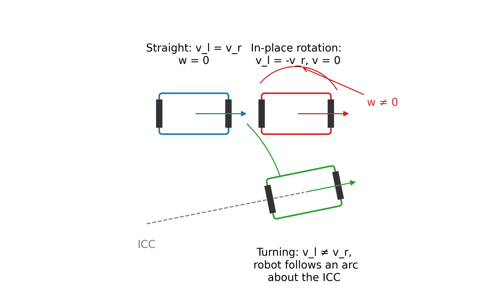
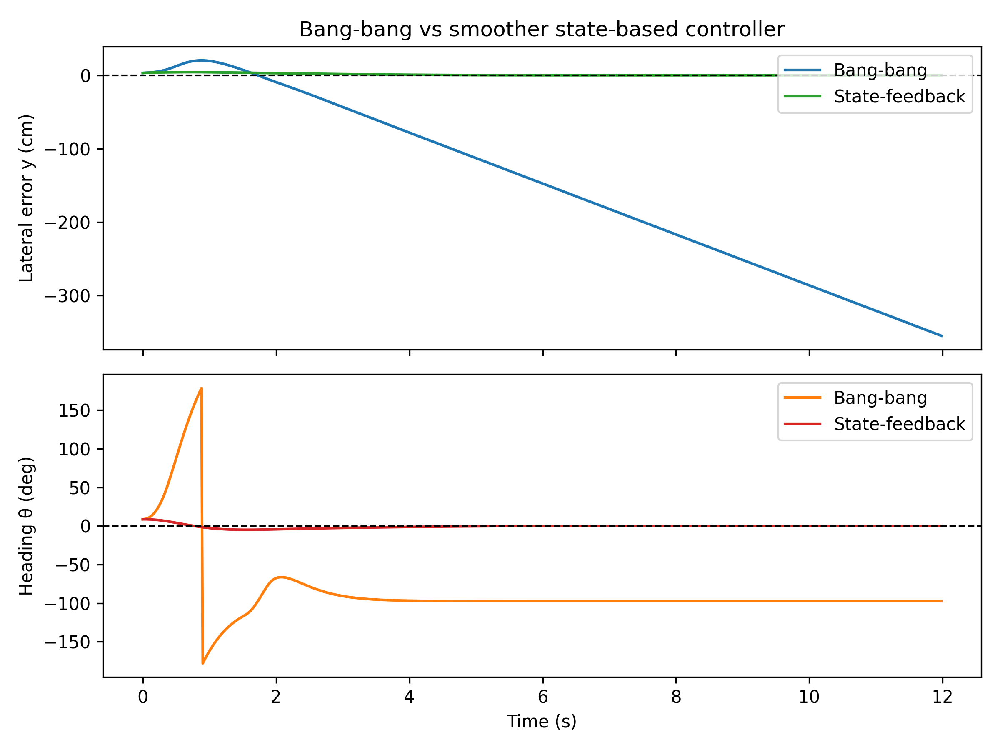

Line follower robot
====================

## 1. The problem: staying on the line

Imagine a small two-wheeled robot driving on a white floor with a **black line** painted on it.

- It has **two drive wheels** (left and right) on the same axle.
- It has **two line sensors**, one near each wheel.
- Each sensor only tells you **“line” (1) or “no line” (0)**.

The goal is simple to state:

- Keep the robot roughly centered over the line.
- Make progress forward.
- Do not lose the line completely.

This is a great example problem because:

- It is **easy to visualize** (you can literally draw it on paper).
- The robot has **very limited sensing** (only a couple of bits).
- To make it work well, we need to think about:
  - Geometry of how a differential-drive robot moves.
  - What a naive controller does and why it struggles.
  - **Time-scales** (fast vs slow dynamics).
  - **Order of control** (are we directly controlling position, velocity, or acceleration?).
  - How to use **state** and **estimation** to do better.

We will first build a very simple controller that more or less “works”, then look carefully at where it breaks, and finally move to a slightly smarter controller that uses more information.

#### Suggested figure


*Figure: A top-down sketch: robot as a rectangle, left and right wheels, two sensors near the front, and a black line on the floor. Mark the wheel separation $L$ and sensor offsets from the robot center.*

---

## 2. How a differential-drive robot moves

Before we talk about control, we need a simple mental model for how the robot moves when we command different wheel speeds.

Let:

- $v_l$ = linear velocity of the **left** wheel (m/s).
- $v_r$ = linear velocity of the **right** wheel (m/s).
- $L$ = distance between the wheels (wheel separation).

We can break the motion into:

- **Forward speed** $v$ of the robot’s center.
- **Angular speed** $w$ (how fast it rotates around its center, positive for counter-clockwise).

The standard differential-drive kinematics say:

$$
  v = \frac{v_r + v_l}{2}, \qquad
  w = \frac{v_r - v_l}{L}.
$$

Some sanity checks:

- If $v_l = v_r$, then $w = 0$ and the robot goes straight.
- If $v_l = -v_r$, then $v = 0$ and the robot spins in place.

We can also go the other way:

Given a desired $v$ and $w$, we can compute:

$$
  v_l = v - \frac{L}{2} w, \qquad
  v_r = v + \frac{L}{2} w.
$$

This is how we will usually think about it in code:

- Decide on a **forward speed** $v$.
- Decide how much we want to **turn** (angular speed) $w$.
- Convert $(v, w)$ into $(v_l, v_r)$ and send those to the motors.

#### Suggested figure



*Figure: Show the robot with its two wheels and center. Draw arrows for $v_l$ and $v_r$. Show cases: $v_l = v_r$ (straight), $v_l = -v_r$ (spin), and a general turn around an instantaneous center of curvature between the wheels.*

---

## 3. Attempt 1: bang-bang control with two binary sensors

We now return to the line follower.

The robot has two line sensors:

- **Left sensor** (L) near the left wheel.
- **Right sensor** (R) near the right wheel.

Each sensor outputs:

- 1 if it “sees” the black line.
- 0 if it only sees the white floor.

So each time step we see a pair of bits:

- $00$: no sensor sees the line.
- $01$: right sensor sees the line, left does not.
- $10$: left sensor sees the line, right does not.
- $11$: both sensors see the line (this may be rare if the line is thin, but we will include it for robustness).

### 3.1 A very simple strategy

We will start with a **bang-bang** (on/off) steering rule:

- Pick a base forward speed $v$ (try to move straight ahead).
- Use the sensor readings only to decide whether to **turn left**, **turn right**, or **not turn**.

Intuitively:

- If the **right sensor** sees the line and the left does not $(01)$, we are drifting **right** of the line, so we should turn **left** (counter-clockwise).
- If the **left sensor** sees the line and the right does not $(10)$, we are drifting **left** of the line, so we should turn **right** (clockwise).
- If both see the line $(11)$ or both see nothing $(00)$, we go straight for now.

Translated into a rule for $w$:

- $00$ or $11$: $w = 0$.
- $01$: $w < 0$ (turn clockwise).
- $10$: $w > 0$ (turn counter-clockwise).

### 3.2 Pseudocode

In a simple control loop, we might write:

```python
while robot_is_running():
    # Base forward speed (pure straight motion if w = 0)
    v = base_speed          # for example, 0.5 m/s

    # How aggressively we turn when we see the line
    rotation_speed = 0.5    # in rad/s, tuned experimentally

    # Read sensors as a pair of bits (L, R)
    sensors = read_line_sensors()  # returns (0, 1), (1, 0), etc.

    if sensors == (0, 1):       # only right sees the line
        w = -rotation_speed     # turn right (clockwise)
    elif sensors == (1, 0):     # only left sees the line
        w = rotation_speed      # turn left (counter-clockwise)
    else:                       # (0, 0) or (1, 1)
        w = 0.0                 # go straight

    # Convert (v, w) to wheel speeds
    v_l = v - 0.5 * L * w
    v_r = v + 0.5 * L * w

    send_to_motors(v_l, v_r)
```

This controller is **extremely simple**:

- It ignores how fast the robot is currently spinning.
- It uses only the **current** sensor readings.
- It does not try to predict where the line will be next.

But surprisingly, on a gentle track, it often **kind of works**: the robot zig-zags around the line and usually stays close enough not to get lost.

#### Suggested figure


*Figure: Show the robot’s lateral error (distance from line), heading error, left/right wheel speeds, and binary sensor readings over time. The path should show a clear zig-zag pattern with sharp corrections when sensors flip state.*

---

## 4. What works and what breaks in Attempt 1

Attempt 1 is a useful starting point, but it has several important limitations.

We will look at three of them:

1. Wheel **saturation** (speed limits) and how that distorts our intended motion.
2. Ignoring **time-scales** and actuator delays.
3. Making decisions from **too little information** (only current sensor bits, no memory).

### 4.1 Wheel speed limits and saturation

In real robots, wheel commands are bounded:

- We might only be allowed to command $v_l, v_r \in [-1, 1]$ (normalized motor power).

If we pick:

- $v = 1.0$ (max forward speed).
- And a nonzero $w$, then the formulas
  $$
    v_l = v - \frac{L}{2}w, \quad v_r = v + \frac{L}{2}w
  $$
  may produce a **wheel command above 1.0**.

For example:

- Suppose $v = 1.0$, $L/2 = 1$, and we choose $w = 0.5$.
- Then
  - $v_l = 1.0 - 0.5 = 0.5$.
  - $v_r = 1.0 + 0.5 = 1.5$ → this is out of range.

In practice, the motor driver will:

- Either **clip** the command to 1.0.
- Or scale things in some other way.

Either way, the actual motion is not what we assumed when we wrote down the kinematics.

One simple fix is to:

- Compute $v_l, v_r$ from $(v, w)$.
- Check whether either is out of bounds.
- If so, **scale both** down so that the largest one hits the limit.

Sketch:

```python
v_l = v - 0.5 * L * w
v_r = v + 0.5 * L * w

max_mag = max(abs(v_l), abs(v_r))
if max_mag > max_speed:
    scale = max_speed / max_mag
    v_l *= scale
    v_r *= scale
```

This keeps the **ratio** between $v_l$ and $v_r$ (and therefore the turn rate) roughly correct, while respecting hardware limits.

#### Suggested figure


*Figure: Plot the commanded $v_l, v_r$ (possibly outside the allowed band) and the clipped/renormalized values actually sent to the motors. Highlight how clipping changes the effective turn rate when the base speed is too high.*

### 4.2 Ignoring dynamics and time-scales

In the pseudocode above, we pretend that:

- As soon as we change $v_l$ and $v_r$ in software, the wheel speeds **instantly** change.

Reality is more complicated:

1. The microcontroller updates the motor command almost instantly (microseconds).
2. The motor driver and coils respond with a small delay (for example, around 20 ms) before current really changes.
3. The **robot body** (mass, friction, inertia) takes **hundreds of milliseconds** to noticeably change speed or heading.

If we think about the robot’s forward speed $v$:

- A large change (for example from 0.0 to 0.8 m/s) may take **0.5 seconds or more**.
- A tiny tweak (from 0.50 to 0.52 m/s) is faster.

The key point:

- We can change **motor current / acceleration** very quickly (tens of milliseconds).
- The actual **velocity and position** change more slowly (hundreds of milliseconds or seconds).

These are **different time-scales** in the same system.

Just like in the filters chapter, it is useful to think:

- Which time-scales do we care about for this controller?
- Are we trying to react to changes that are faster than the robot can physically move?

If we update the bang-bang controller very quickly and always assume instantaneous response, we may ask the robot to do things it simply **cannot** do that fast.

### 4.3 Decisions from just the current bits

In Attempt 1:

- At each step, we look only at the **current** sensor pair $(L, R)$.
- We do not remember where the line was a moment ago.
- We do not use any estimate of **how far** we are from the line, or how quickly we are drifting away.

With just two bits and no memory, we can only do very coarse decisions:

- Turn sharply left or right when a sensor flips.
- Go straight otherwise.

This naturally leads to:

- **Zig-zag paths**.
- Over-corrections when we are already close to the line.
- Occasional loss of the line on corners or at higher speeds.

To do better, we will need:

- Some notion of **state** (an estimate of where we are relative to the line).
- A controller that uses that state more smoothly, instead of only reacting when bits flip.

**Takeaway:** Attempt 1 is simple and can “sort of” follow a line, but it ignores wheel limits, physical delays, and any memory of the recent past. All three will matter when we try to make the robot behave more smoothly and robustly.

---

## 5. Time-scales: how quickly can we really change things?

Let us look more closely at the idea of time-scales in this specific robot.

Consider the forward speed $v$ of the robot:

- We command a motor current (or a motor power value).
- Motor current is roughly proportional to **acceleration** (how quickly speed changes).
- Suppose the maximum acceleration we can achieve is limited: $|v'| \leq a_{\max}$.

If we want to change speed by $\Delta v$, the fastest we can possibly do it is roughly:

$$
  \text{time} \approx \frac{\Delta v}{a_{\max}}.
$$

Heavier robots have:

- The same motor power, but more mass to move.
- So their maximum acceleration $a_{\max}$ is smaller.
- That means they respond more slowly to the same change in command.

For our line follower, this means:

- Quick changes in **commanded** wheel speed may not produce quick changes in **actual** wheel speed or position.
- There is a **slow mechanical time-scale** on top of the very fast electronic one.

When we design controllers, it often helps to:

- Treat very fast time-scales (microseconds to a few milliseconds) as essentially “instant”.
- Focus on the **slowest** time-scale that dominates behavior we care about (for example, “how quickly can the robot move from one side of the line to the other?”).

**Takeaway:** When you think about how much control you have over a variable (like speed or heading), always ask “how long does it actually take to change this by a meaningful amount?”, not just “how fast can I change the command in code?”.

---

## 6. Order of control: position, velocity, and momentum

Another useful idea is **order of control**:

- Do we directly control **position** $x$?
- Or do we control its **velocity** $x'$?
- Or only its **acceleration** $x''$?

### 6.1 Car analogy: stopping at a finish line

Imagine you are driving a car and want to stop exactly at a finish line.

If you used a naive rule like:

- “If I am **left** of the finish line, press the gas pedal fully forward.”
- “If I am **right** of the finish line, press the gas pedal fully backwards.”

you would:

- Overshoot the line.
- Then slam into reverse.
- Overshoot again in the other direction.
- And keep oscillating back and forth.

Why?

- The car’s motion has **momentum**.
- You do not control position directly; you control **acceleration** (through engine/brake forces).

If instead you could magically set your position directly (first-order control), you could simply “snap” to the line with much less overshoot.

### 6.2 First-order vs second-order behavior

In many robotics problems:

- We have relatively direct control over a **velocity-like** quantity.
- Position then comes from **integrating** that velocity.

For the line follower:

- We can change motor current quickly → change acceleration.
- That changes wheel speed $v$ more slowly.
- That changes the robot’s **lateral position** and **heading** even more slowly.

So from the point of view of the line’s lateral error $y$ (distance from robot center to the line):

- We effectively have **second-order** control (position comes from integrating speed, which comes from integrating acceleration).

Higher “order of control” tends to mean:

- More **momentum-like** behavior.
- Harder to stop exactly at a target.
- Controllers need to anticipate and **slow down near the goal** instead of always pushing at full power.

This is why many practical controllers:

- Do not just slam controls to extremes.
- Use smooth feedback (for example, proportional or PID control) that reduces effort as you get close to the desired state.

#### Suggested figure


*Figure: Compare a first-order response (smoothly approaching a target without overshoot) to an underdamped second-order response (overshoot and oscillation). Relate the second-order curve to a robot trying to correct its lateral error with strong bang-bang commands.*

**Takeaway:** For the line follower, we should remember that we are not directly controlling “distance to the line”; we influence it through wheel acceleration and heading. This second-order nature explains much of the overshoot and oscillation we see with naive bang-bang control.

---

## 7. Attempt 2: use estimated state $(y, \theta, v, w)$

To improve on Attempt 1, we will:

- Assume we have access to a few **state variables** describing the robot relative to the line.
- Use a smoother feedback law that adjusts turning and speed based on those states.

Let:

- $y$: lateral distance from the robot center to the line (we want $y = 0$).
- $\theta$: heading error between the robot’s forward direction and the line (we want $\theta = 0$).
- $v$: forward speed of the robot.
- $w = \theta'$: angular speed (how fast the heading is changing).

In a real robot, we do **not** measure all of these directly.

- We will later sketch how to estimate them from encoders and line sensors.
- For now, we pretend some estimator gives us $(y, \theta, v, w)$ each time step.

### 7.1 A simple feedback law

We will:

- Pick a base forward speed $v_{\text{base}}$.
- Adjust the turn rate $w$ based on a weighted combination of:
  - Lateral error $y$.
  - Heading error $\theta$.
  - Current spin rate $w$ itself.

Intuitively:

- If $y$ is positive (robot is to the right of the line), we want to turn left.
- If $\theta$ is positive (robot is rotated counter-clockwise relative to the line), we may want to turn back clockwise.
- If $w$ is already large, we may want to reduce it to avoid over-rotating.

We can write:

$$
  w_{\text{command}} = - c_y y - c_\theta \theta - c_w w,
$$

where $c_y, c_\theta, c_w$ are tunable gains.

We also slow down when we are far from the line or badly misaligned, to give the robot more time to correct:

$$
  v_{\text{forward}} =
  \text{limit}\Big(
    v_{\text{base}} - k_y |y| - k_\theta |\theta|,
    0,\ v_{\text{base}}
  \Big),
$$

where $k_y, k_\theta$ are “slow-down” gains.

### 7.2 Pseudocode

Putting this together:

```python
def control_step(state):
    # Unpack estimated state relative to the line
    y      = state.y        # lateral error (m)
    theta  = state.theta    # heading error (rad)
    v      = state.v        # current forward speed (m/s)
    w_curr = state.w        # current angular speed (rad/s)

    # Tuning parameters
    base_speed    = 0.5
    position_gain = 1.0     # c_y
    angle_gain    = 0.8     # c_theta
    spin_gain     = 0.2     # c_w
    slow_gain_y   = 0.8     # k_y
    slow_gain_th  = 0.8     # k_theta

    # Compute a turn command from position, angle, and current spin
    turn_from_y   = -position_gain * y
    turn_from_th  = -angle_gain * theta
    turn_from_spin = -spin_gain * w_curr

    w_cmd = turn_from_y + turn_from_th + turn_from_spin

    # Slow down when we are far from the line or badly misaligned
    v_cmd = base_speed
    v_cmd -= slow_gain_y  * abs(y)
    v_cmd -= slow_gain_th * abs(theta)
    v_cmd = limit(v_cmd, 0.0, base_speed)

    # Convert (v_cmd, w_cmd) to wheel speeds and enforce limits
    v_l = v_cmd - 0.5 * L * w_cmd
    v_r = v_cmd + 0.5 * L * w_cmd

    v_l, v_r = limit_wheels(v_l, v_r, max_speed)
    send_to_motors(v_l, v_r)
```

Compared to Attempt 1, this controller:

- reacts **continuously** to how far we are from the line and how we are angled.
- slows down when things look bad, instead of charging ahead.
- takes into account the current spin $w$ to avoid over-rotating.

With reasonable gains, the robot tends to:

- Follow the line more smoothly.
- Overshoot less on corners.
- Recover more gracefully after small disturbances.

#### Suggested figure



*Figure: Compare the zig-zag trajectory and error from Attempt 1 to the smoother trajectory and smaller peak error from this state-based controller.*

**Takeaway:** By estimating a small state $(y, \theta, v, w)$ and using it in a simple feedback law, we turn a twitchy bang-bang line follower into something that behaves much more like a smooth, well-damped system.

---

## 8. Sketch: estimating $(y, \theta, v, w)$ from encoders and line sensors

We have so far **pretended** we know $y, \theta, v, w$.
Now we will briefly sketch how we might estimate them in practice.

We assume:

- We can read wheel speeds $v_l, v_r$ from **encoders** (or at least estimate them).
- We still have the two binary line sensors near the front.
- We run a control loop at a fixed time step $\Delta t$.

### 8.1 Getting $v$ and $w$ from encoders

From the differential-drive kinematics:

$$
  v = \frac{v_r + v_l}{2}, \qquad
  w = \frac{v_r - v_l}{L}.
$$

If we update this every control cycle:

- We get reasonably good short-term estimates of forward speed and angular speed.
- Encoders are usually quite reliable over short time-scales.

### 8.2 Predicting $y$ and $\theta$ by dead-reckoning

We define $y$ and $\theta$ relative to the line:

- $y$: lateral distance from robot center to the line (positive to one side).
- $\theta$: heading error between robot’s direction and the line direction.

If during one small time step $\Delta t$ we move with speeds $v$ and $w$, we can **predict** how $y$ and $\theta$ change:

$$
  \theta \leftarrow \theta + w \Delta t,
$$
$$
  y \leftarrow y + v \sin(\theta)\, \Delta t.
$$

For small $\theta$, we often approximate $\sin(\theta) \approx \theta$, which keeps the math simple and still captures how heading error slowly turns into lateral error.

So a basic predict step is:

```python
theta = theta + w * dt
y     = y + v * math.sin(theta) * dt   # or y += v * theta * dt for small theta

# Keep theta in [-pi, pi] to avoid numerical drift
theta = wrap_angle(theta)
```

This is called **dead-reckoning**: we update our state based on how we think we moved, without looking at sensors yet.

### 8.3 Correcting using the line sensors

The two line sensors sit at known lateral offsets from the robot center:

- Left sensor: at $+d/2$.
- Right sensor: at $-d/2$.

When a sensor reports “line”, we can treat it as a **noisy measurement** that the line passes under that sensor’s lateral position.

We can turn the two bits $(L,R)$ into a crude measurement of $y$:

```python
def lateral_measurement_from_sensors(L, R, d):
    if (L, R) == (1, 0):       # line under left sensor only
        return +0.5 * d
    elif (L, R) == (0, 1):     # line under right sensor only
        return -0.5 * d
    elif (L, R) == (1, 1):     # both see line -> roughly centered
        return 0.0
    else:                      # (0, 0): no direct measurement
        return None
```

At each time step:

1. We run the **predict** step to update $y$ and $\theta$.
2. We read sensor bits $(L, R)$ and turn them into a tentative measurement `y_meas`.
3. If `y_meas` is not `None`, we blend it with our predicted $y$.

The blending can be as simple as an **exponential moving average**:

```python
alpha = 0.3   # between 0 and 1; how much we trust the sensor

if y_meas is not None:
    y = (1.0 - alpha) * y + alpha * y_meas
```

This is a tiny **predict–correct** filter:

- If the sensors agree with dead-reckoning, we only nudge $y$ a little.
- If they disagree, $y$ slowly drifts toward what sensors say.
- If sensors see nothing for a few steps, we rely on prediction alone.

In this simple sketch:

- We mainly correct $y$ using the line sensors.
- We let $\theta$ evolve from the encoder-based $w$.
- With a bit more hardware (for example, a third sensor further forward, or a gyro), we could also correct $\theta$ explicitly.

### 8.4 Putting it all together

A single estimator step might look like:

```python
def estimator_step(state, v_l, v_r, sensors, dt):
    # 1. Compute v and w from wheel speeds
    v = 0.5 * (v_r + v_l)
    w = (v_r - v_l) / L

    # 2. Predict theta and y from motion
    state.theta += w * dt
    state.theta = wrap_angle(state.theta)

    state.y += v * math.sin(state.theta) * dt

    # 3. Correct y using line sensors, if available
    L_bit, R_bit = sensors
    y_meas = lateral_measurement_from_sensors(L_bit, R_bit, sensor_spacing_d)

    if y_meas is not None:
        state.y = (1.0 - alpha_y) * state.y + alpha_y * y_meas

    # 4. Update stored v and w for the controller
    state.v = v
    state.w = w
```

This estimator is intentionally simple:

- It ignores many real-world complications (slip, curvature of the line, sensor noise patterns).
- But it already turns raw encoder ticks and two bits of line information into a **continuous state** that the controller can use.

#### Suggested figure


*Figure: Show true lateral error $y$, the dead-reckoned prediction that slowly drifts, the discrete corrections from line-sensor hits, and the blended estimate that stays close to the truth. Highlight how prediction carries the estimate between sensor hits.*

**Takeaway:** By combining encoder-based prediction with occasional, coarse line-sensor measurements, we can maintain a usable estimate of where the robot is relative to the line—even though each sensor alone is very limited.

---

## 9. Summary and takeaways

In this chapter, we used the line follower as a small but rich example of control in robotics.

- **Start simple:** A bang-bang controller that turns only when a sensor sees the line can often follow a track, but it naturally zig-zags and is sensitive to speed, curvature, and delays.
- **Respect physics:** Wheel saturation, actuator limits, and slow mechanical dynamics mean we cannot instantly get the motion we ask for in code.
- **Think in time-scales and order of control:** Understanding what we control directly (acceleration vs velocity vs position) explains overshoot and oscillation.
- **Use state and estimation:** A small estimated state $(y, \theta, v, w)$, combined with a smooth feedback law and a simple predict–correct estimator, already yields a much more robust and graceful line follower.

As you build more complex robots, you will see the same pattern repeat:

- Start with a naive controller to understand the problem.
- Notice where it breaks.
- Introduce state, estimation, and smoother feedback to tame time-scales and momentum.


